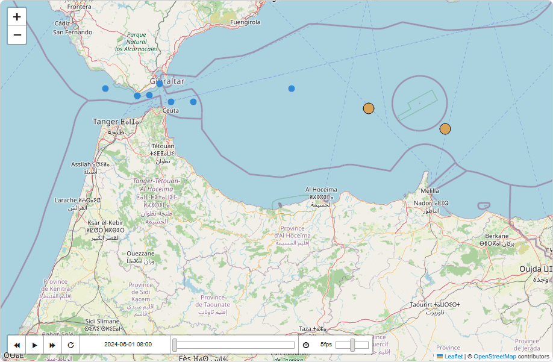

# Maritime Domain Awareness

**English** · [Español](README.md)

[](https://github.com/alberto-navas/maritime-domain-awareness/actions/workflows/tests.yml)
[](LICENSE)

Analysis of real, historical AIS data to flag anomalous vessel behavior —
transmission gaps, physically implausible position/speed jumps — as leads
for a human analyst to review, not verdicts.

<p align="center">
  
</p>

*Web panel (`python -m src.web`) playing back the Strait of Gibraltar demo
scenario — a real Leaflet map, not a pre-recorded video: each track draws
over time and each finding appears at its exact moment.*

## Motivation

Ships above a certain size broadcast their position, speed, and identity
by radio (AIS), publicly, for navigation safety. That same system, looked
at in aggregate, also gives away behavior that falls outside the norm: a
vessel that stops transmitting in the wrong place, a position jump no
real physics explains, a declared speed that doesn't match its own
displacement. None of this proves anything on its own — but it's exactly
the kind of signal a maritime surveillance analyst wants pre-filtered and
explained before looking at the raw data. This project is that filtering
layer, applied to real, public historical data (unlike the sibling
[C-UAS Threat Triage](https://github.com/alberto-navas/cuas-threat-triage)
project, where the data has to be synthetic because no public equivalent
dataset exists).

## Capabilities

Four independent, separately auditable detectors — `src/detectors/`:

- **AIS transmission gaps** (`gaps.py`, single track): flags intervals
  between consecutive position reports above what's expected, with the
  threshold calibrated by the navigational status declared right before
  the gap (an anchored vessel transmits much less often than one
  underway, and the detector accounts for that instead of confusing the
  two).
- **Implausible kinematic jumps** (`kinematics.py`, single track): two
  rules over the same pair of consecutive fixes — the speed implied by
  the position displacement exceeds what any real vessel could reach
  (same principle as a "GPS glitch"), or that implied speed doesn't match
  the SOG (speed over ground) the vessel itself reports at all.
- **Vessel-to-vessel rendezvous/loitering** (`rendezvous.py`, track
  pair): for every pair of MMSIs whose tracks overlap in time, matches
  each vessel's reports to the other's nearest in time and flags sustained
  stretches where they're close, nearly stationary, and outside any real
  port/anchorage zone — the classic undeclared ship-to-ship transfer
  pattern. See "Port zones" below for the real mask it uses.
- **Identity inconsistency** (`identity.py`, single track + static data):
  three structural checks, no thresholds to calibrate — the same MMSI
  declares a different name/callsign/IMO at different points in the
  dataset, a declared IMO fails its own official check digit, or an MMSI
  transmitting as a ship falls outside the range ITU-R M.585 reserves for
  ship stations.

Every finding (`Finding`) carries its category, severity, position, and a
`description` explaining the concrete reasoning — which threshold was
exceeded and with what values — never a conclusion (see "What this
project deliberately does NOT do" below).

**Web panel** (`src/web/`, optional, not part of the analysis pipeline
itself): upload a CSV or load the bundled demo scenario (Strait of
Gibraltar) and see an animated map (real Leaflet tiles, real coastlines)
with a playback slider — each track draws progressively over time and
each finding appears as a marker at its exact moment, alongside the
findings table. A thin layer over the same `src/pipeline.py` the CLI
uses: it doesn't reimplement any detector.

**Spanish / English / German**: the CLI (`--lang`) and the web panel
(language switcher on the page) can produce the full report — findings,
static or animated map, console messages — in any of the three
languages. Each detector only ever generates its `description` in
Spanish (plus `message_key`/`message_params` to reconstruct it in
another language, see `src/i18n.py`); a detector never knows the concept
of language exists.

## Architecture

```
Historical AIS CSV (DMA)                    Port/anchorage GeoJSON (OSM)
        │                                                 │
        ▼                                                 ▼
src/ingest.py                              src/zones.py (spatial index
  -> PositionReport[] + VesselIdentity[])     -> PortZones)
        │                                                 │
        ▼                                                 │
src/tracks.py                                              │
  (groups by MMSI, sorts by time -> Track)                 │
        │                                                 │
        ▼                                                 │
src/detectors/gaps.py         (transmission gaps)          │
src/detectors/kinematics.py   (implausible jumps + SOG)     │
src/detectors/rendezvous.py   (encounters) ◄─────────────────┘
src/detectors/identity.py     (identity, uses VesselIdentity[] directly)
        │
        ▼
src/pipeline.py   (orchestrates ingest -> tracks -> detectors -> Finding[])
        │
        ├─────────────────────────────────┐
        ▼                                  ▼
src/report.py                      src/web/animated_map.py
  (findings.json/.csv +              (animated Leaflet map)
   static map PNG)                            │
        ▲                                     ▼
        │                          src/web/app.py (FastAPI, optional)
src/cli.py                                    │
                                      python -m src.web
```

`src/model.py` is the shared vocabulary (`PositionReport`,
`VesselIdentity`, `Track`, `Finding`) used across every stage: no
detector knows the source CSV format, and ingest knows nothing about any
detector.

Each detector's thresholds live in `src/config.py`, documented one by one
with the reasoning behind each value, and can be overridden without
touching code via a YAML file (see `config/thresholds.yaml`).

`rendezvous.py` is the only detector that compares PAIRS of tracks
instead of a single one — it evaluates every pair of MMSIs whose time
ranges overlap, which is O(n²) in vessel count in the worst case. The
time-overlap filter discards the vast majority of pairs before comparing
position; optimizing further (e.g. a spatial index over tracks) is out of
scope for this version — a documented limitation, noted in the module
itself.

`identity.py` is the only detector with no configurable thresholds: its
three checks are structural (an identity either changed or didn't, a
check digit is either valid or isn't) — there's no "how much is too much"
to calibrate, so it doesn't take a `DetectorConfig`.

`src/web/` is an optional layer: the analysis pipeline (`src/pipeline.py`
+ detectors) imports nothing from `src/web/` and knows nothing of its
existence. It only adds an alternative way to view the same
`PipelineResult` — an animated map instead of a static PNG — without
touching any detection logic.

## Usage

```bash
# One CSV -> findings + map in output/
python -m src.cli data/samples/2024-01-01.csv

# Several consecutive days -> a single combined report
python -m src.cli data/samples/2024-01-*.csv --output output/january/

# Custom thresholds
python -m src.cli data/samples/2024-01-01.csv --config config/thresholds.yaml

# Alternative port/anchorage zones (defaults to the bundled Denmark/Baltic extract)
python -m src.cli data/samples/2024-01-01.csv --zones data/zones/other_extract.geojson

# Report (findings.json/.csv/map.png) and console messages in English or German
python -m src.cli data/samples/2024-01-01.csv --lang en
```

Produces `findings.json`, `findings.csv` (same content, for opening in
any spreadsheet) and `map.png` (each track as a line, each finding as a
point colored by severity):

<p align="center">
  
</p>

**Web panel** (optional):

```bash
python -m src.web
# -> http://127.0.0.1:8000
```

Upload your own CSV or click "View demo" to load the bundled Strait of
Gibraltar scenario (`data/demo/alboran_strait.csv`, see "Demo scenario"
below) and see the animated map. The ES/EN/DE switcher top-right changes
the language of the whole page — the URL (`?lang=en`) is self-contained,
no cookies or session state.

## Tests

```bash
pytest -v
```

99 tests covering all fourteen pipeline and web-panel modules (geo,
ingest, tracks, config, zones, i18n, all four detectors, pipeline,
report, CLI, animated map, web panel), using versioned synthetic fixtures in
`tests/fixtures/` that follow DMA's real column schema — none depend on
downloading anything external (the port-zone extracts and the demo
scenario are versioned too, but they're local files, not test-time
downloads). They run automatically on every `push` via GitHub Actions
(`.github/workflows/tests.yml`), on Ubuntu and Windows.

## Code quality

```bash
ruff check .        # lint
ruff format .       # formatting
mypy src/           # static type checking
```

Configured in `pyproject.toml`. Checked automatically on every `push` (a
`lint` job separate from the test matrix).

**Test coverage**: 98% (`pytest --cov=src`), with a CI threshold of 85%
as a safety net against a large regression, not as a line-by-line target
to chase.

## Test data

Danish Maritime Authority historical AIS files
(https://web.ais.dk/aisdata/) are free to download, but their
redistribution terms aren't clear enough to version a real excerpt in a
public repository without confirming that first. That's why
`tests/fixtures/sample_dma.csv` is synthetic, hand-written to exactly
follow DMA's real column schema (same names, same date format, same
sentinel values like `Heading = 511` for "not available"), with
deliberate cases for each detector: a transmission gap, an impossible
position jump, an SOG mismatch, a sustained open-water encounter, a name
change, an IMO with an invalid check digit, a structurally invalid MMSI,
and the cases that should **not** fire (an anchored vessel with a
long-but-normal gap, a base-station row that isn't a vessel, a row with
no valid MMSI, an encounter inside a port zone).

To analyze real data: download any daily file from
https://web.ais.dk/aisdata/ and pass it directly to the CLI — the column
schema matches.

## Demo scenario (web panel)

`data/demo/alboran_strait.csv` is a second synthetic dataset, separate
from the test one: bigger (13 vessels) and set in the Strait of Gibraltar
and the Alboran Sea — not real data (DMA doesn't cover this region), a
made-up but geographically realistic scenario, generated by
`data/demo/generate_alboran_demo.py`, built so the web panel
(`python -m src.web` -> "View demo") has several vessels moving at once
and at least one case of each of the four detectors. The Baltic dataset
(`tests/fixtures/sample_dma.csv`) remains the one used by the tests and
the screenshot above.

## Port zones

`rendezvous.py` needs to tell a sustained open-water encounter apart from
two vessels simply docked or anchored in the same port — otherwise it
would fire on every port in the dataset. For that it uses real
[OpenStreetMap](https://www.openstreetmap.org/copyright) extracts (ODbL
license) — port and anchorage polygons (`seamark:type=harbour` /
`seamark:type=anchorage`), one per scenario: `data/zones/dk_baltic_ports.geojson`
(909 polygons, Denmark/Baltic) and `data/zones/alboran_ports.geojson` (23
polygons, Strait of Gibraltar/Alboran). Only real polygons are included
(closed OSM `way` elements); standalone nodes and multipolygon relations
are deliberately dropped — see `data/zones/README.md` for the exact
source, the full license text, and how to regenerate or create a new
extract with `data/zones/fetch_ports.py`.

## What this project deliberately does NOT do

This is an **analysis and flagging layer for human review**, never an
interdiction or automated-decision tool:

- It does not decide or execute any action — neither interception nor
  automatic alerting to any authority. The output is a list of leads for
  a human analyst to investigate with context the system itself doesn't
  have (local traffic, weather, the area's historical pattern).
- "Flagged as suspicious" is not "guilty." Every `Finding` explains the
  concrete calculation that generated it (which threshold, with what
  values), never a conclusion about the vessel's intent.
- It is not live tracking: it only processes historical AIS data already
  published legally for research, never a real-time connection to
  vessels operating right now — the web panel's animated map is a replay
  of already-loaded historical/synthetic data, with play/pause and a time
  slider, not a live connection to any real vessel.
- The rendezvous detector (`rendezvous.py`) flags a PATTERN consistent
  with a planned encounter (proximity + low speed + sustained duration,
  outside a port zone) — it does not confirm a transfer took place, does
  not identify what (if anything) was transferred, and analyzes nothing
  beyond the position and speed both vessels already declared.
- The identity detector (`identity.py`) flags structural inconsistencies
  (a value changed, a check digit doesn't add up) — it does not attempt
  to determine a vessel's "real" identity, does not query any external
  naval registry (Equasis, IHS Fairplay...) to verify against the actual
  vessel, and a detected name change can have a completely legitimate
  explanation (sale, change of operator).
- Thresholds are explainable heuristics, not "ground truth" — a
  transmission gap has completely normal explanations (loss of VHF
  coverage offshore, channel congestion) just as often as suspicious
  ones. The detector doesn't tell those two causes apart; it only flags
  where to look.

## Possible extensions

- **MID-to-flag-state validation**: check that the MMSI's MID prefix maps
  to a country code actually allocated by the ITU (today `identity.py`
  only validates the structural 2-7 range, not the full country table —
  see the module).
- **More complete port-zone coverage**: include the multipolygon
  relations dropped from the current extract (see the documented
  limitation in `data/zones/README.md`), or extend the bounding box
  beyond Denmark/Baltic.
- **Speed threshold by vessel type**: `VesselIdentity.ship_type` is
  already parsed; `kinematics.py`'s plausible-speed ceiling could be
  calibrated per type instead of a single global threshold.
- **Live deployment of the web panel** (like the sibling projects, via
  Render): for now the web panel is only meant to run locally
  (`python -m src.web`).
