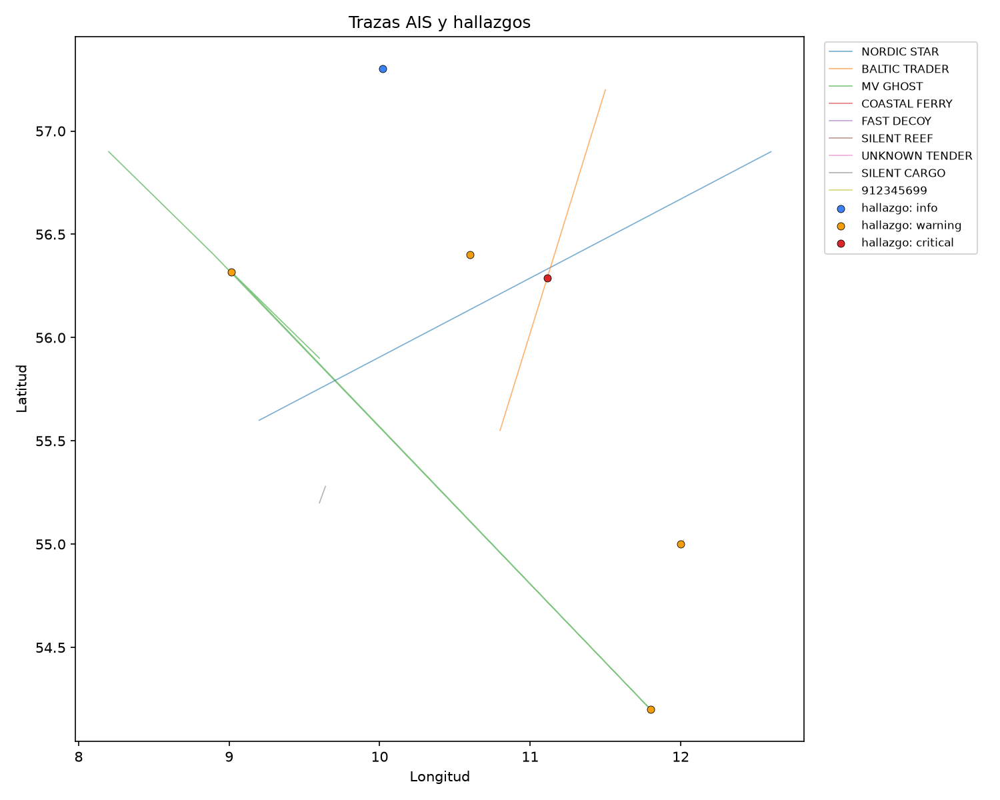

# Maritime Domain Awareness

[English](README.en.md) · **Español**

[](https://github.com/alberto-navas/maritime-domain-awareness/actions/workflows/tests.yml)
[](LICENSE)

Analisis de datos AIS historicos y reales para señalar comportamiento
naval anomalo — huecos de transmision, saltos de posicion/velocidad
implausibles — como pistas para que un analista humano las revise, no
como veredictos.

<p align="center">
  
</p>

*Mapa generado con datos sinteticos de demostracion (ver "Datos de prueba"
mas abajo) — cada linea es un buque, cada punto coloreado un hallazgo.*

## Motivacion

Todo buque de cierto tamaño emite su posicion, velocidad e identidad por
radio (AIS) de forma publica, por seguridad de navegacion. Ese mismo
sistema, mirado en agregado, tambien delata comportamiento fuera de lo
normal: un buque que deja de transmitir en la zona equivocada, un salto de
posicion que ninguna fisica real explica, una velocidad declarada que no
cuadra con el propio desplazamiento. Nada de esto prueba nada por si
solo — pero es exactamente el tipo de señal que un analista de vigilancia
maritima quiere tener ya filtrada y explicada antes de mirar el dato en
bruto. Este proyecto es esa capa de filtrado, aplicada a datos historicos
reales y publicos (a diferencia del proyecto hermano de
[C-UAS Threat Triage](https://github.com/alberto-navas/cuas-threat-triage),
donde el dato tiene que ser sintetico porque no existe un dataset publico
equivalente).

## Capacidades

Cuatro detectores independientes y auditables por separado, `src/detectors/`:

- **Huecos de transmision AIS** (`gaps.py`, una sola traza): marca
  intervalos entre informes de posicion consecutivos por encima de lo
  esperable, con el umbral calibrado segun el estado de navegacion
  declarado justo antes del hueco (un buque fondeado transmite mucho
  menos a menudo que uno navegando, y el detector lo tiene en cuenta para
  no confundir lo uno con lo otro).
- **Saltos cinematicos implausibles** (`kinematics.py`, una sola traza):
  dos reglas sobre el mismo par de fixes consecutivos — la velocidad que
  implica el desplazamiento de posicion supera lo que cualquier buque
  real podria alcanzar (mismo principio que un "glitch de GPS"), o esa
  velocidad implicada no se parece en nada al SOG (velocidad sobre el
  fondo) que el propio buque declara.
- **Encuentros/loitering entre buques** (`rendezvous.py`, pareja de
  trazas): para cada par de MMSI cuyas trazas se solapan en el tiempo,
  empareja los informes mas cercanos en el tiempo entre ambos buques y
  marca los tramos sostenidos donde estan cerca, casi parados, y fuera de
  cualquier zona portuaria/fondeadero real — el patron clasico de un
  transbordo ship-to-ship no declarado. Ver "Zonas portuarias" mas abajo
  para la mascara real que usa.
- **Inconsistencia de identidad** (`identity.py`, una sola traza + datos
  estaticos): tres comprobaciones estructurales, sin umbrales que
  calibrar — el mismo MMSI declara un nombre/indicativo/IMO distinto en
  momentos diferentes del dataset, un IMO declarado no supera su propio
  digito de control oficial, o un MMSI transmitiendo como buque no cae en
  el rango que ITU-R M.585 reserva a estaciones de buque.

Cada hallazgo (`Finding`) lleva su categoria, severidad, posicion, y una
`description` en español que explica el razonamiento concreto — que
umbral se superó y con qué valores — nunca una conclusión (ver mas abajo,
"Qué NO hace este proyecto").

**Panel web** (`src/web/`, opcional, no forma parte del pipeline de
analisis en si): sube un CSV o carga el escenario de demostracion
(Estrecho de Gibraltar) y ve un mapa animado (Leaflet real, con costas
reales) con un slider de reproduccion — cada traza se dibuja
progresivamente con el tiempo y cada hallazgo aparece como marcador en su
instante exacto, junto a la tabla de hallazgos. Capa fina sobre el mismo
`src/pipeline.py` que usa el CLI: no reimplementa ningun detector.

**Español / English / Deutsch**: el CLI (`--lang`) y el panel web
(selector de idioma en la pagina) pueden generar el informe completo
— hallazgos, mapa estatico o animado, mensajes de consola — en
cualquiera de los tres idiomas. Cada detector solo genera su
`description` en español (mas `message_key`/`message_params` para
reconstruirla en otro idioma, ver `src/i18n.py`); un detector nunca sabe
que existe el concepto de idioma.

## Arquitectura

```
CSV historico de AIS (DMA)                 GeoJSON de puertos/fondeadero (OSM)
        │                                                 │
        ▼                                                 ▼
src/ingest.py                              src/zones.py (indice espacial
  -> PositionReport[] + VesselIdentity[])     -> PortZones)
        │                                                 │
        ▼                                                 │
src/tracks.py                                              │
  (agrupa por MMSI, ordena por tiempo -> Track)             │
        │                                                 │
        ▼                                                 │
src/detectors/gaps.py         (huecos de transmision)      │
src/detectors/kinematics.py   (saltos implausibles + SOG)  │
src/detectors/rendezvous.py   (encuentros) ◄────────────────┘
src/detectors/identity.py     (identidad, usa VesselIdentity[] directamente)
        │
        ▼
src/pipeline.py   (orquesta ingest -> tracks -> detectores -> Finding[])
        │
        ├─────────────────────────────────┐
        ▼                                  ▼
src/report.py                      src/web/animated_map.py
  (findings.json/.csv +              (mapa Leaflet animado)
   mapa estatico PNG)                        │
        ▲                                    ▼
        │                          src/web/app.py (FastAPI, opcional)
src/cli.py                                   │
                                     python -m src.web
```

`src/model.py` es el vocabulario comun (`PositionReport`, `VesselIdentity`,
`Track`, `Finding`) que usan todas las etapas: ningun detector conoce el
formato CSV de origen, y el ingest no conoce ningun detector.

Los umbrales de cada detector viven en `src/config.py`, documentados uno a
uno con el razonamiento de por que ese valor y no otro, y se pueden
sobreescribir sin tocar codigo con un YAML (ver `config/thresholds.yaml`).

`rendezvous.py` es el unico detector que compara PAREJAS de trazas en vez
de una traza aislada — evalua cada par de MMSI cuyo rango temporal se
solapa, lo que en el peor caso es O(n²) en numero de buques. El filtro de
solape temporal descarta la inmensa mayoria de pares antes de comparar
posicion; optimizarlo mas alla de eso (p.ej. un indice espacial de trazas)
queda fuera del alcance de esta version — limitacion conocida, documentada
en el propio modulo.

`identity.py` es el unico detector sin umbrales configurables: sus tres
comprobaciones son estructurales (una identidad cambia o no, un digito de
control es valido o no), no hay "cuanto es demasiado" que calibrar, asi
que no recibe `DetectorConfig`.

`src/web/` es una capa opcional: el pipeline de analisis (`src/
pipeline.py` + detectores) no importa nada de `src/web/` ni sabe que
existe. Solo añade una forma alternativa de ver el mismo
`PipelineResult` — un mapa animado en vez de un PNG estatico — sin tocar
ninguna logica de deteccion.

## Uso

```bash
# Un CSV -> hallazgos + mapa en output/
python -m src.cli data/samples/2024-01-01.csv

# Varios dias consecutivos -> un unico informe combinado
python -m src.cli data/samples/2024-01-*.csv --output output/enero/

# Umbrales personalizados
python -m src.cli data/samples/2024-01-01.csv --config config/thresholds.yaml

# Zonas portuarias/fondeadero alternativas (por defecto, el extracto de
# Dinamarca/Baltico incluido en data/zones/)
python -m src.cli data/samples/2024-01-01.csv --zones data/zones/otro_extracto.geojson

# Informe (findings.json/.csv/map.png) y mensajes de consola en ingles o aleman
python -m src.cli data/samples/2024-01-01.csv --lang en
```

Genera `findings.json`, `findings.csv` (mismo contenido, para abrir en
cualquier hoja de calculo) y `map.png` (cada traza como una linea, cada
hallazgo como un punto coloreado por severidad).

**Panel web** (opcional):

```bash
python -m src.web
# -> http://127.0.0.1:8000
```

Sube un CSV propio o pulsa "Ver demo" para cargar el escenario del
Estrecho de Gibraltar incluido (`data/demo/alboran_strait.csv`, ver
"Escenario de demostracion" mas abajo) y ver el mapa animado. El
selector ES/EN/DE arriba a la derecha cambia el idioma de toda la
pagina — la URL (`?lang=en`) es autocontenida, sin cookies ni estado de
sesion.

## Tests

```bash
pytest -v
```

99 tests cubriendo los catorce modulos del pipeline y del panel web (geo,
ingest, tracks, config, zonas, i18n, los cuatro detectores, pipeline,
informe, CLI, mapa animado, panel web), con fixtures sinteticas versionadas en
`tests/fixtures/` que siguen el esquema real de columnas de DMA — ninguno
depende de descargar nada externo (los extractos de zonas portuarias y el
escenario de demostracion si estan versionados, pero son ficheros locales,
no una descarga en tiempo de test). Se ejecutan automaticamente en cada
`push` via GitHub Actions (`.github/workflows/tests.yml`), en Ubuntu y
Windows.

## Calidad de codigo

```bash
ruff check .        # lint
ruff format .       # formato
mypy src/           # comprobacion estatica de tipos
```

Configurado en `pyproject.toml`. Comprobado automaticamente en cada
`push` (job `lint` separado del de tests).

**Cobertura de tests**: 98% (`pytest --cov=src`), con un umbral de CI en
85% como red de seguridad contra una caida grande, no como objetivo linea
a linea a perseguir.

## Datos de prueba

Los ficheros AIS historicos de la Danish Maritime Authority
(https://web.ais.dk/aisdata/) son gratuitos para descargar, pero sus
terminos de redistribucion no estan lo bastante claros como para
versionar un recorte real en un repositorio publico sin confirmarlo
primero. Por eso `tests/fixtures/sample_dma.csv` es sintetico, escrito a
mano siguiendo exactamente el esquema de columnas real de DMA (mismos
nombres, mismo formato de fecha, mismos valores centinela como
`Heading = 511` para "no disponible"), con casos deliberados de cada
detector: un hueco de transmision, un salto de posicion imposible, una
discrepancia de SOG, un encuentro sostenido en aguas abiertas, un cambio
de nombre, un IMO con digito de control invalido, un MMSI estructuralmente
invalido, y los casos que **no** deberian dispararse (un buque fondeado
con un hueco largo pero normal, una fila de estacion base que no es un
buque, una fila sin MMSI valido, un encuentro dentro de una zona
portuaria).

Para un analisis con datos reales: descarga cualquier fichero diario de
https://web.ais.dk/aisdata/ y pasalo directamente al CLI — el esquema de
columnas coincide.

## Escenario de demostracion (panel web)

`data/demo/alboran_strait.csv` es un segundo dataset sintetico, distinto
del de tests: mas grande (13 buques) y situado en el Estrecho de
Gibraltar y el Mar de Alboran — no son datos reales (DMA no cubre esta
region), es un escenario inventado pero geograficamente realista,
generado por `data/demo/generate_alboran_demo.py`, pensado para que el
panel web (`python -m src.web` -> "Ver demo") tenga varios buques
moviendose a la vez y al menos un caso de cada uno de los cuatro
detectores. El dataset del Baltico (`tests/fixtures/sample_dma.csv`)
sigue siendo el que usan los tests y la captura de arriba.

## Zonas portuarias/fondeadero

`rendezvous.py` necesita distinguir un encuentro sostenido en aguas
abiertas de dos buques simplemente atracados o fondeados en el mismo
puerto — si no, dispararia en cada puerto del dataset. Para eso usa
extractos reales de [OpenStreetMap](https://www.openstreetmap.org/copyright)
(licencia ODbL) — poligonos de puerto y fondeadero
(`seamark:type=harbour` / `seamark:type=anchorage`), uno por escenario:
`data/zones/dk_baltic_ports.geojson` (909 poligonos, Dinamarca/Baltico) y
`data/zones/alboran_ports.geojson` (23 poligonos, Estrecho de
Gibraltar/Alboran). Solo se incluyen poligonos reales (elementos `way`
cerrados de OSM); nodos sueltos y relaciones multipoligono se descartan
deliberadamente — ver `data/zones/README.md` para la fuente exacta, la
licencia completa, y como regenerar o crear un extracto nuevo con
`data/zones/fetch_ports.py`.

## Qué NO hace este proyecto (deliberadamente)

Esto es una capa de **analisis y señalizacion para revision humana**,
nunca de interdiccion ni de decision automatizada:

- No decide ni ejecuta ninguna accion — ni de intercepcion, ni de alerta
  automatica a ninguna autoridad. La salida es una lista de pistas para
  que un analista humano las investigue con contexto que el propio
  sistema no tiene (trafico local, meteorologia, patron historico de la
  zona).
- "Marcado como sospechoso" no es "culpable". Cada `Finding` explica el
  calculo concreto que lo genero (que umbral, con que valores), nunca una
  conclusion sobre la intencion del buque.
- No es tracking en vivo: solo procesa datos AIS historicos ya publicados
  legalmente para investigacion, nunca una conexion en tiempo real a
  buques operando ahora mismo — el mapa animado del panel web es una
  reproduccion de datos historicos/sinteticos ya cargados, con play/pausa
  y un slider de tiempo, no una conexion en vivo a ningun buque real.
- El detector de encuentros (`rendezvous.py`) señala un PATRON compatible
  con un encuentro planificado (proximidad + baja velocidad + duracion
  sostenida, fuera de zona portuaria) — no confirma que sea un transbordo,
  no identifica que se transfirio (ni si se transfirio algo), y no analiza
  nada mas alla de la posicion y velocidad ya declaradas por ambos buques.
- El detector de identidad (`identity.py`) señala inconsistencias
  estructurales (un dato cambio, un digito de control no cuadra) — no
  intenta determinar la identidad "real" del buque, no consulta ningun
  registro naval externo (Equasis, IHS Fairplay...) para verificar contra
  el buque real, y un cambio de nombre detectado puede tener una
  explicacion completamente legitima (venta, cambio de armador).
- Los umbrales son heuristicas explicables, no una "verdad" — un hueco de
  transmision tiene explicaciones completamente normales (perdida de
  cobertura VHF en alta mar, congestion de canal) tan a menudo como
  sospechosas. El detector no distingue esas dos causas; solo señala
  donde mirar.

## Posibles extensiones

- **Validacion de MID contra el pais de registro**: comprobar que el
  prefijo MID del MMSI corresponde a un codigo de pais realmente asignado
  por la ITU (hoy `identity.py` solo valida el rango estructural
  2-7, no la tabla completa de paises — ver el modulo).
- **Cobertura de zonas portuarias mas completa**: incluir las relaciones
  multipoligono de OSM descartadas en el extracto actual (ver limitacion
  documentada en `data/zones/README.md`), o ampliar el bounding box mas
  alla de Dinamarca/Baltico.
- **Umbral de velocidad por tipo de buque**: `VesselIdentity.ship_type`
  ya se parsea; el techo de velocidad plausible de `kinematics.py` podria
  calibrarse por tipo en vez de un unico umbral global.
- **Despliegue en vivo del panel web** (como los proyectos hermanos, via
  Render): de momento el panel web solo esta pensado para correr en
  local (`python -m src.web`).
